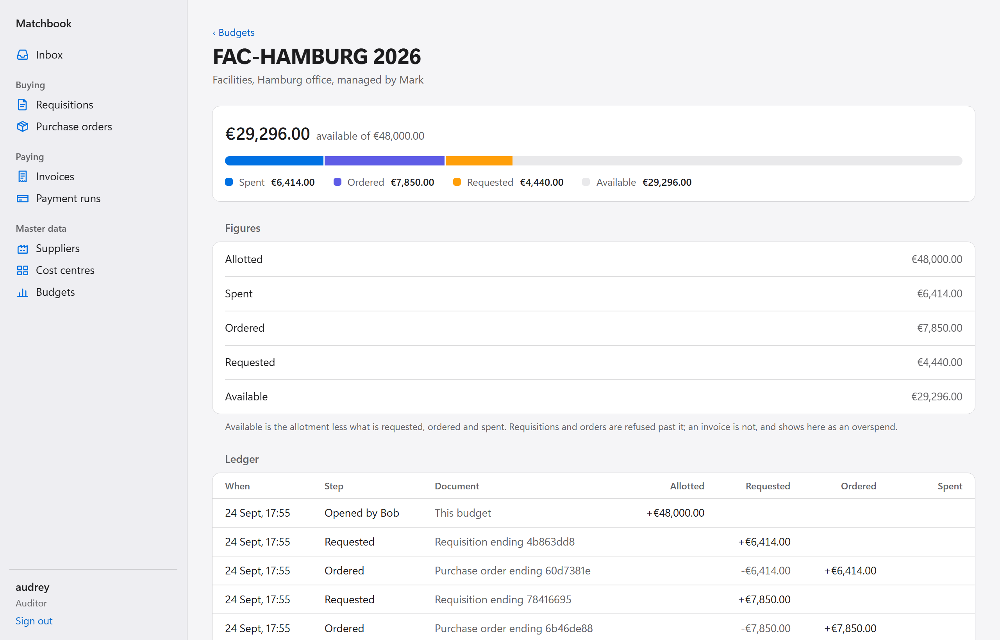
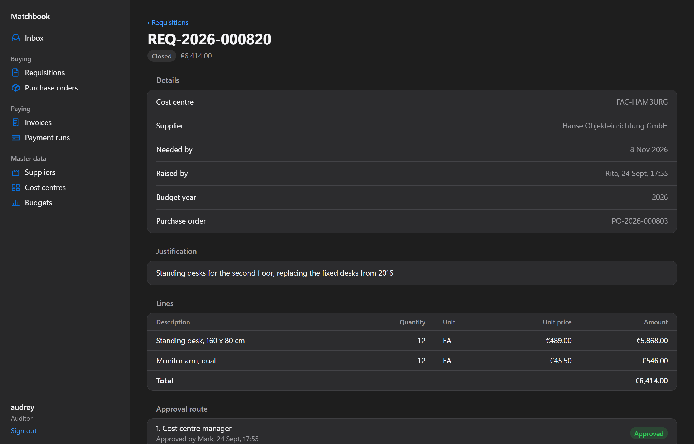
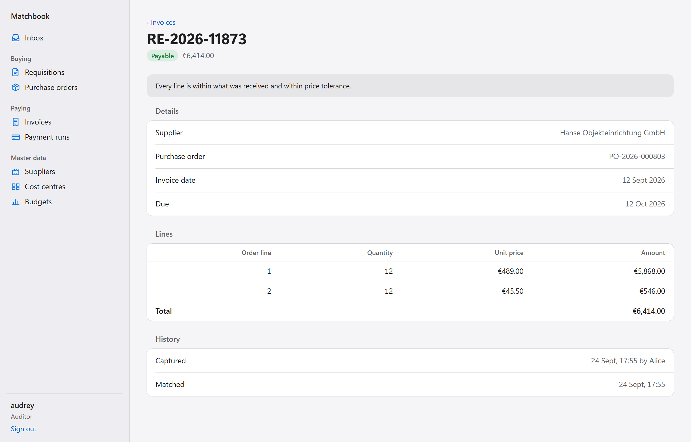

# Matchbook

[](https://github.com/tunahanaliozturk/matchbook/actions/workflows/ci.yml)
[](LICENSE)

The purchase-to-pay half of an ERP as five .NET 10 microservices and a Vue console: request, approve against a
budget, order, receive, match the invoice three ways, pay.

**Thirty purchases run while RabbitMQ restarts and the two services that hold money are killed with SIGKILL.
Every invoice is still paid exactly once, and the five databases reconcile to the cent on eight cross-service
invariants: 18.8 s from the first request to a clean close at the median of five runs** (Intel Core Ultra 7
255H, Docker Desktop on WSL2; `docs/measurements/chaos.md`, test `ChaosTests`). The same check fails on a
single cent put wrong by hand.

## Quick start

Needs Docker and the .NET 10 SDK; Node 24 for the browser journeys.

```
git clone https://github.com/tunahanaliozturk/matchbook.git && cd matchbook
docker compose up -d --build --wait
dotnet run --project tests/Matchbook.SystemTests
cd web && npm ci && npx playwright install chromium && npm run test:e2e
```

`docker compose up` builds seven images and starts eleven containers. The system tests then walk a purchase from
request to payment through the gateway, run the chaos test above, and reconcile after each. The journeys sign
people in through Keycloak and hand the work from one person to the next in the console. CI runs exactly these
commands on every push.

To try it by hand, open the console at http://localhost:5301 and sign in as `rita` to raise a requisition, `mark`
to approve it, and so on through `bruno`, `rosa`, `alice`, `tess` and `trevor`. Every seeded user's password is
`matchbook` (the list is in `docs/design.md`). The `http/` folder has every endpoint for an editor that runs
`.http` files, starting with `http/suppliers.http`. Traces, metrics and logs are in the Aspire dashboard at
http://localhost:18888.

## How a purchase moves

```
rita (requester)     Requisitions ── RequisitionSubmitted ──▶ Budgets        reserve the amount
                     Requisitions ◀── FundsReserved ───────── Budgets
mark (manager)       approves; over 10,000 fiona (finance) too; over 100,000 carl (CFO) too
                     Requisitions ── RequisitionApproved ───▶ Purchasing     draft an order
bruno (buyer)        Purchasing ── PurchaseOrderCommitmentRequested ──▶ Budgets   reservation becomes commitment
                     Purchasing ── PurchaseOrderIssued ─────▶ Payables, Requisitions
rosa (receiver)      Purchasing ── GoodsReceived ───────────▶ Payables
alice (AP clerk)     Payables: order, receipt and invoice agree?  ── InvoiceMatched ──▶ Budgets, Purchasing
tess, then trevor    Payables: payment run drafted by one treasurer, released by another, pain.001 file
```

No service calls another over HTTP. Each owns one Postgres database, publishes through a transactional outbox and
consumes through an inbox, and the gateway (YARP) is the only way in. Separation of duties is enforced in the
domain, not the UI: nobody approves their own requisition, the receiver cannot be the buyer who issued the order,
and a bank account change, a supplier activation and a payment run each need a second person.

## The console



One screen per job, and each person sees only their own: rita's inbox holds drafts to finish and refusals to read,
mark's the requisitions waiting on the cost centres they manage, trevor's the payment runs another treasurer
drafted. The inbox is built from one
queue per decision, contributed by the feature that owns it, so a slow service delays only its own section.

| | |
|---|---|
|  |  |

It is a Vue 3 single-page app behind nginx, with a small design system of its own rather than a component
library (ADR 0009). The access token lives in memory only, never in storage a script could read. The client is
generated from the services' OpenAPI documents and checks every response against a Zod schema; CI regenerates it
against the running stack and fails on any difference.
Every journey runs axe in the light and the dark appearance and fails on a single Content Security Policy
violation; the policy allows no inline script and no `eval`.

## The decision worth arguing with

**Consumers never assume order, and they never throw because something has not arrived yet** (ADR 0002). There
is no saga orchestrator. RabbitMQ keeps one queue in order, but each service reads several queues with sixteen
messages in flight and retries put messages behind later ones, so `GoodsReceived` can reach Payables before the
order it belongs to, and `RequisitionCancelled` can reach Budgets before the `RequisitionSubmitted` it cancels.
Every consumer stores what it was told and acts once the rest is present: Payables keeps the receipt and matches
when the order arrives; Budgets leaves a tombstone for the cancellation and refuses the late reservation.

What that buys: no coordinator to fail, and each service can be down without stopping the others, which the
chaos test shows. What it costs: the process is not written down in one place in code, only in
`docs/design.md`, and proving it correct takes a reconciler that reads five databases and checks the invariants
no single service can see (`tests/Matchbook.Stack/Reconciliation.cs`). A reviewer who prefers an orchestrator
has a fair case; ADR 0002 names it and says why it lost here.

## What is proved, and where

| Claim | Evidence |
|---|---|
| Two hundred simultaneous reservations against room for fifty grant exactly fifty | `Two_hundred_simultaneous_reservations_against_room_for_fifty_grant_exactly_fifty` (Budgets) |
| An invoice is paid at most once, however the runs race | `Two_treasurers_drafting_at_the_same_moment_never_put_one_invoice_in_both_runs`, `Releasing_a_run_twice_at_once_pays_each_invoice_once_and_the_file_carries_exactly_those_payments` (Payables) |
| A duplicate invoice number is caught even when two clerks capture it at once | `Two_captures_of_one_number_at_the_same_moment_create_one_invoice` (Payables) |
| IBANs never appear in plain text at rest, in an outbox or on the broker | ADR 0007, and the Suppliers and Payables integration tests that read the raw columns and messages |
| Money reconciles across all five databases after restarts and kills | `ChaosTests`, `docs/measurements/chaos.md` |
| A 5,000 invoice payment run drafts in 1.5 to 2.4 s and releases in 2.0 to 3.1 s | `PaymentRunScaleTests`, `docs/services/payables.md` |
| No project references another service's projects, and Domain references nothing but the shared kernel | `tests/Matchbook.ArchitectureTests` |
| Every command and query lives in its feature folder with exactly one handler, and no query can publish | `FeatureLayoutTests` (ADR 0008) |
| The screens the journeys visit meet WCAG 2 AA in both appearances | 34 axe checks across the five journeys, each in light and dark (`expectAccessible`, `web/e2e/support.ts`) |
| The console agrees with the services' contracts | The contract drift step in CI, against the running stack |

Against real Postgres 18 and RabbitMQ 4.3 in containers throughout; there is no in-memory database or transport
anywhere in the tests. 666 unit tests, 223 integration tests, 75 architecture tests and 2 system tests on the
services; 55 unit tests and 5 browser journeys on the console.

## Stack

.NET 10 and C# 14, ASP.NET Core minimal APIs, EF Core 10 on Npgsql, MassTransit 8.5 with the Entity Framework
outbox and inbox, RabbitMQ, YARP, Keycloak, OpenTelemetry to the Aspire dashboard. xUnit v3 with Shouldly and
FsCheck, Testcontainers. The console is Vue 3.5 with Vite, TanStack Query, Zod, a client generated by
`@hey-api/openapi-ts`, `oidc-client-ts` for the PKCE sign-in and two Reka UI primitives, tested with Vitest,
Playwright and axe. MassTransit is pinned to 8.5 because version 9 is commercially licensed; a licence
audit in CI (`tools/Matchbook.LicenseAudit`, and `web/scripts/licence-audit.mjs` for npm) fails the build on any
package, at any depth, whose licence would cost a commercial user money.

## Further reading

- `docs/design.md`: the contract the services are built to, including every cross-service invariant.
- `docs/adr/`: nine decisions, each with the alternatives that lost.
- `docs/services/`: one document per service: states, rules, what the database enforces, metrics, and the
  decisions its author made.
- `docs/operations.md`: configuration, what to watch, a runbook per anticipated failure, known limitations.
- `docs/contracts.md`: the integration events, which a test pins by name and shape.

## Known limitations

The full list is in `docs/operations.md`. The ones a reviewer is most likely to hit first:

- The outbox delivers at least once. A reply can reach the broker twice under one message id; every consumer's
  inbox drops the copy, but anything else listening to the broker has to do the same.
- The reconciler runs only in the tests, not on a schedule.
- One currency, one replica per service tested, migrations run at startup.
- The console names people from a directory compiled into it, because a person's own token cannot list
  Keycloak's users; a deployment would read it from the identity provider.

## Licence

MIT. See `LICENSE`.
